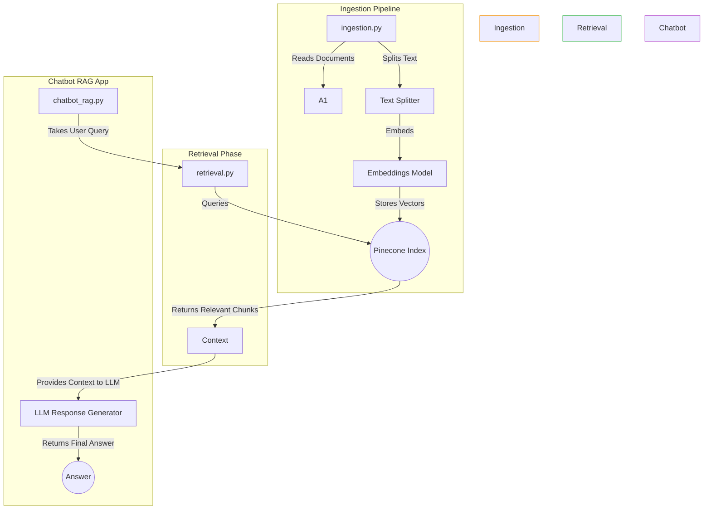

```mermaid
flowchart TD

    subgraph Ingestion Pipeline
        B1[ingestion.py] -->|Reads Documents| A1
        B1 -->|Splits Text| B2[Text Splitter]
        B2 -->|Embeds| B3[Embeddings Model]
        B3 -->|Stores Vectors| C1((Pinecone Index))
    end

    subgraph Retrieval Phase
        D1[retrieval.py] -->|Queries| C1
        C1 -->|Returns Relevant Chunks| D2[Context]
    end

    subgraph Chatbot RAG App
        E1[chatbot_rag.py] -->|Takes User Query| D1
        D2 -->|Provides Context to LLM| E2[LLM Response Generator]
        E2 -->|Returns Final Answer| E3((Answer))
    end

    style Ingestion Pipeline fill:#fff4e6,stroke:#f08c00,stroke-width:1px
    style Retrieval Phase fill:#e6ffe6,stroke:#37b24d,stroke-width:1px
    style Chatbot RAG App fill:#f5e6ff,stroke:#ae3ec9,stroke-width:1px
```
